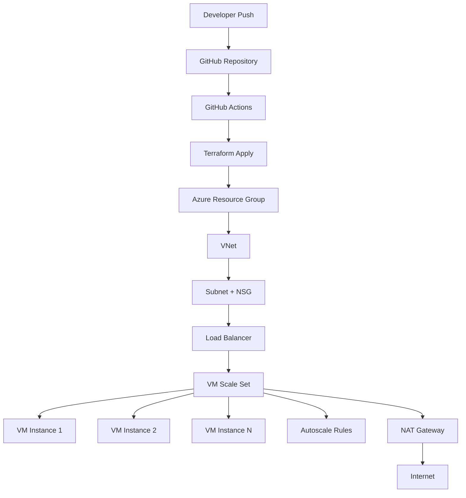

# Azure 3-Tier Architecture with Terraform & GitHub Actions

## 🚀 Project Overview

This project provisions a highly available Azure 3-tier architecture using Terraform and deploys it through a GitHub Actions CI/CD pipeline.


### Infrastructure includes:
- Virtual Network (VNet)
- Subnet with NSG
- Load Balancer
- Virtual Machine Scale Set (VMSS)
- Autoscaling rules
- NAT Gateway
- Remote Terraform backend (Azure Storage)

### GitHub Actions automates:
- Terraform init
- Terraform validate
- Terraform plan
- Terraform apply

---

## 🏗️ Architecture



---

## ⚙️ Tech Stack
- Terraform
- GitHub Actions
- Azure Cloud
- Azure VMSS
- Azure Load Balancer
- Azure Autoscale
- Azure Remote Backend

---
## 📂 Repository Structure

```bash
.
├── .github/workflows
│   └── terraform-azure.yml
├── main.tf
├── vnet.tf
├── autoscale.tf
├── provider.tf
├── backend.tf
├── variables.tf
├── outputs.tf
├── user-data.sh
└── README.md
```
---

## 🔐 GitHub Secrets Required

Add the following secrets in GitHub:
- AZURE_CLIENT_ID
- AZURE_TENANT_ID
- AZURE_SUBSCRIPTION_ID
- TF_RG
- TF_STORAGE

---

## 🔄 CI/CD Workflow

The GitHub Actions pipeline performs:
1. Checkout repository
2. Azure login using OIDC
3. Terraform init (remote backend)
4. Terraform validate
5. Terraform plan
6. Terraform apply (main branch only)

---

## ▶️ How to Deploy

Push code to main branch:

```bash
git push origin main
```
---
## 📈 Autoscaling Rules

-	Scale out when CPU > 80%
-   Scale in when CPU < 10%
-	Minimum instances: 1
-	Maximum instances: 10

---
## 🌐 Output
This will render:
- Proper headings  
- Bullet points aligned  
- Code block structure  
- Professional GitHub README  

After pasting → commit → refresh GitHub page.


